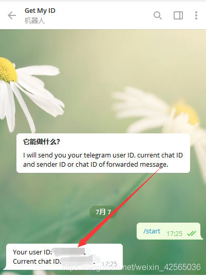

# 京东豆自动领取搭建
## 第一步 配置系统【以下均在甲骨文centos 7 X86-64系统上上操作】
  
##升级系统&软件包
```bash
sudo -i
yum -y update
```
##关闭禁用防火墙
```bash
firewall-cmd --state                   # 查看防火墙状态
systemctl stop firewalld.service       # 停止防火墙
systemctl disable firewalld.service    # 禁止防火墙开机自启
```
(重启机器）
##   第二部安装  docker 两种方式
     
###     第一种：手动安装   docker
     1.命令方式安装
```bash     
 curl -fsSL https://get.docker.com/ | sh
 sudo systemctl start docker
 sudo systemctl status docker
sudo systemctl enable docker
```
### 第二种宝塔面板安装   docker
    2.安装宝塔面板下载docker 国内版官网： https://www.bt.cn/bbs/thread-19376-1-1.html
（当前版本7.7  宝塔会强制绑定手机号码登陆，可以安装海外版避开，个人推荐安装国内版, 然后在打开宝塔前执行方法二命令即可解除宝塔的强制绑定）
### bt.cn官方上安装脚本：
```bash
sudo -i
yum install -y wget && wget -O install.sh http://download.bt.cn/install/install_6.0.sh && sh install.sh
```
### 方法一、安装BT面板海外版
```bash
官网：https://www.aapanel.com/
```
### 方法二、安装完国内BT后在SSH执行如下命令
```bash
echo "{\"uid\":1000,\"username\":\"admin\",\"serverid\":1}" > /www/server/panel/data/userInfo.json
```

打开宝塔面板后到，面版设置里自行设置能记住的登陆路径和用户名与密码。

然后打开软件商店，搜索docker管理器，点击安装等待完成。

## 第三步 安装青龙面板
### 安装青龙面板 https://github.com/whyour/qinglong/blob/develop/INSTALL.md

### 复制下列命令在ssh执行(先安装docker)
```bash
docker run -dit \
   -v $PWD/ql/config:/ql/config \
   -v $PWD/ql/log:/ql/log \
   -v $PWD/ql/db:/ql/db \
   -v $PWD/ql/repo:/ql/repo \
   -v $PWD/ql/raw:/ql/raw \
   -v $PWD/ql/scripts:/ql/scripts \
   -v $PWD/ql/jbot:/ql/jbot \
   -p 5700:5700 \
   --name qinglong \
   --hostname qinglong \
   --restart unless-stopped \
   whyour/qinglong:latest
 ```  
##   登录
```bash
打开浏览器访问宿主机ip的5700端口即可
例如http://192.168.100.123:5700即ip:5700

首次登录
账号:admin 密码:admin
会生成`auth.json`

在ssh输入 
1.docker exec -it qinglong bash
2.cat /ql/config/auth.json

cat查看之后返回的结果类似如下字段

{"username":"admin","password":"Xb-ZYP526wmg4_h6q1WqIO"}
 admin即为登录名;Xb-ZYP526wmg4_h6q1WqIO为登录密码
 ```

### 到这就结束青龙面板的基础安装了，自行选择某位大佬的仓库使用【青龙面板定时任务】，每个大佬脚本需要的变量和依赖有所不同。
###     coocie添加在【环境变量】
# coocie 查找方式：
```bash
打开：https://bean.m.jd.com/  
     登录后按F12
     点击【Network】--【ALL】 搜索【log】刷新页面 在coocie中找到pt_key=xxxxxxxxxxxxxxx;pt_pin=xxxxxxxxx
 ```
     
# 自动添加coocie面板搭建
###  原：
```bash
bash <(curl -sL https://raw.githubusercontent.com/King-stark/normal-shell/main/onekey-install-nvjdc.sh)
```
###  自备份 
```bash bash <(curl -sL https://raw.githubusercontent.com/xiaoyaogsj/jd/main/onekey-install-nvjdc.sh) ```
###  服务器名称 自定义 英文
###  青龙ID   青龙面板 【系统设置】--【应用设置】-【环境变量】
    
# TG机器人通知
## 申请bot，获取token 

### 1、打开TG 搜索botfather 按提示申请bot。
### 2、输入
 ```bash
 /newbot
```
### 3、再输入机器人名称。便可得到token 


## 搜索getmyid_bot 获取USER id
###  输入 
```bash
/start
```

 

## 配置青龙
 
### 1、点击【系统设置】--【通知设置】--【TG机器人】。
    
    将获取到的token 和 id  输入并保存。
    
### 2、点击【配置文件】  找到【3. Telegram】。
    
    将获取到的token 和 id  输入并保存。
    


## 完成    
 
 
 
 
